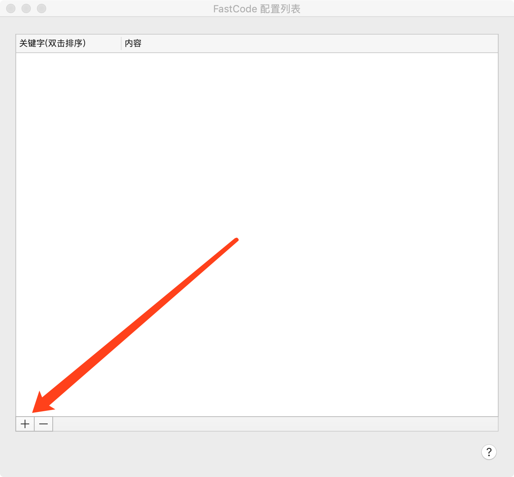
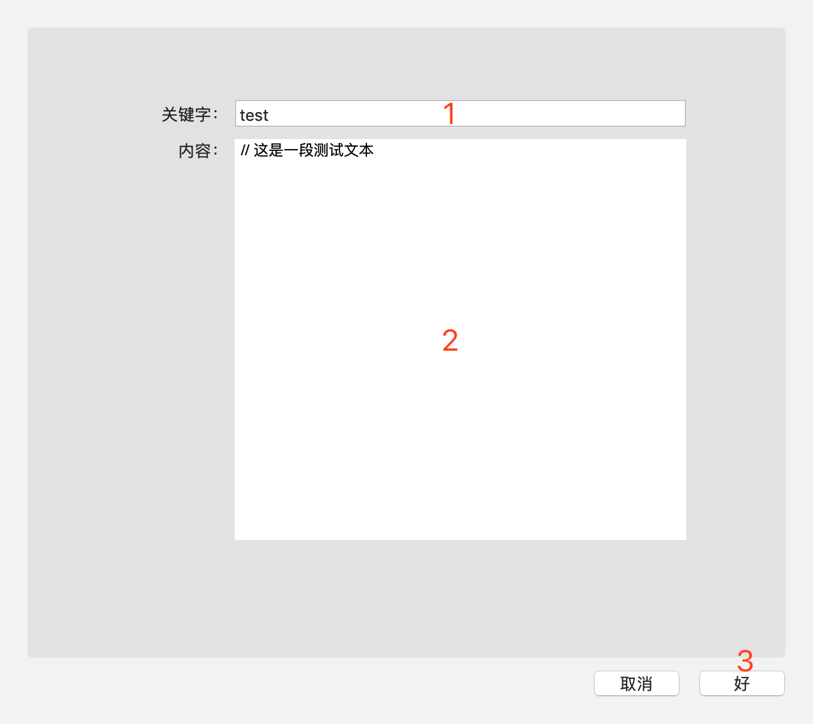
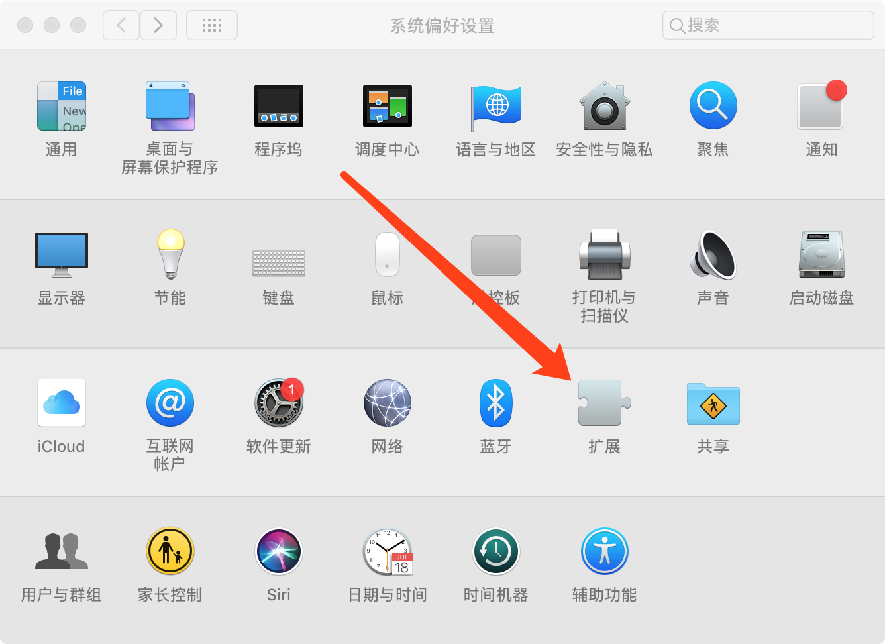
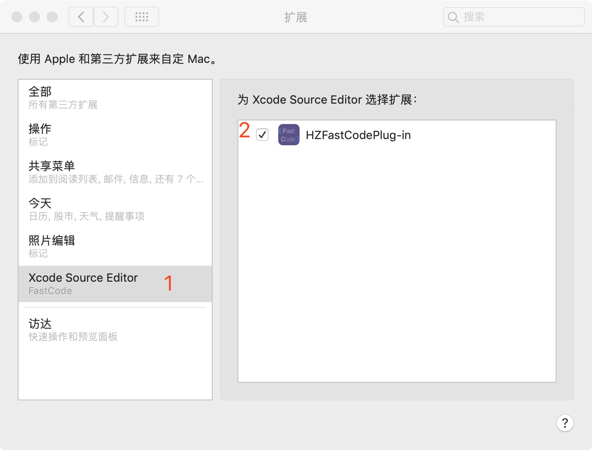
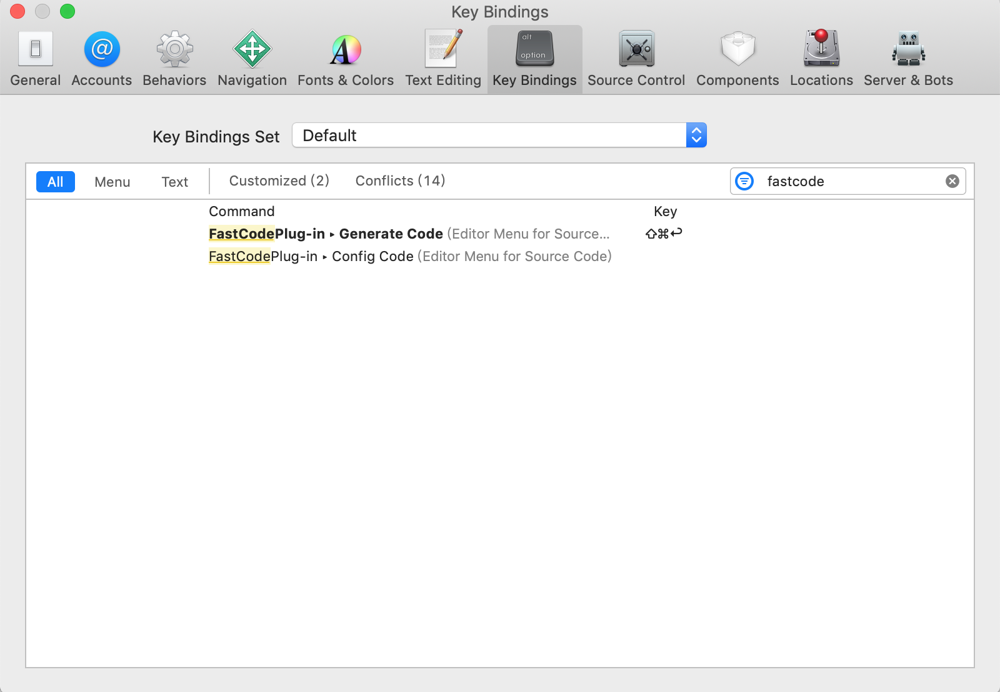
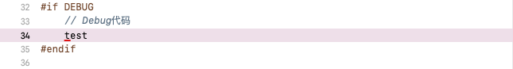
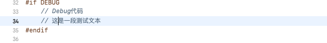

# FastCode 帮助手册

## 第一步：配置 FastCode

1. 点击“+”号，进入【添加配置界面】
	
	
	
2. 输入“关键字”和“内容”后点击“好”

	
	
* 主界面双击Item进入编辑界面

## 第二步：开启 Xcode Source Editor

1. 打开【系统偏好设置】，点击【扩展】

	
	
2. 选择“Xcode Source Editor”并勾选“HZFastCodePlug-in”

	
	
### 第三步：Xcode 设置快捷键

1. 启动 Xcode（已启动需要退出后再打开）
2. 点击【Xcode】->【Preferences...】(快捷键⌘,)进入偏好配置界面
3. 设置快捷键：

	
	
### 第四步：使用

1. 在Xcode文件任意单行中输入【关键字】

	
	
2. 按下设定的快捷键，或执行【Editor】->【FastCodePlug-in】->【Generate Code】

	

